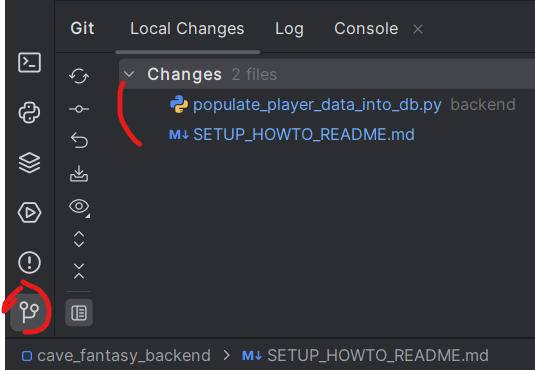

# Developer How-To

### Tools:
1. Download git
   * https://git-scm.com/download/win
2. Download python v3.11
   * https://www.python.org/downloads/release/python-3119/
3. Download PyCharm Community
   * https://www.jetbrains.com/pycharm/download/?section=windows
4. Install Docker
   
---

### Project Setup:
1. Create a local directory, then initialize the directory to use git
    * `git init`
2. Clone github project into your directory
   * `git clone https://github.com/alexp8/cave-bois-fantasy-backend.git`
3. Setup Pycharm interpreter
   * 
4. Right click 'backend' and mark as 'Sources Root'
5. Build docker
   * `docker-compose build`
6. Run server
   * from `backend/` enter `docker-compose up -d`
7. Run migrations
   * `docker exec -it fantasy_trades_app /bin/bash`
   * `python manage.py migrate`

##### Docker commands
- `docker-compose build --no-cache`  _build docker images fresh_
- `docker exec -it fantasy_trades_app /bin/bash` _terminal into docker app_
- `docker logs fantasy_trades_app`
- `docker-compose up -d` _start docker app_
- `docker-compose down`

##### Migration Commands
- `python manage.py showmigrations`
- `python manage.py makemigrations`
- `python manage.py migrate`
- `python manage.py shell`

---

#### Git Tip
   * Disable "Use non-modal commit interface"
   * 
   * 
 